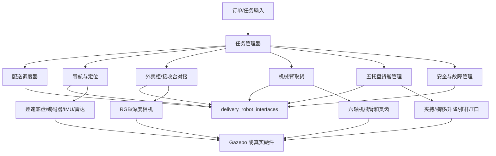
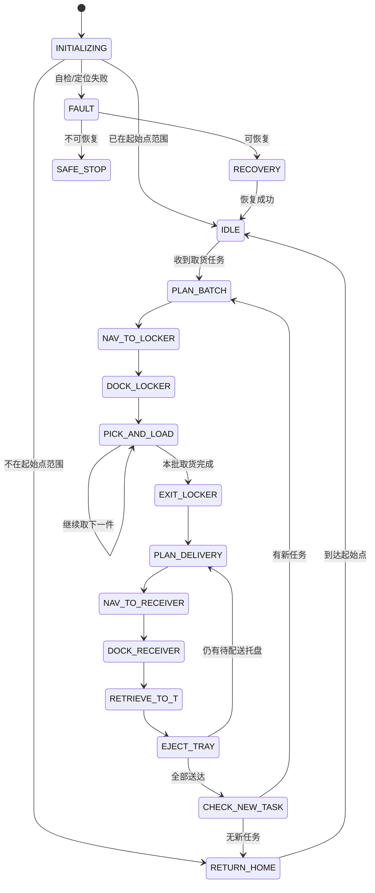

# 外卖自动送货机器人项目总体框架、系统设计及开发计划

**文档版本：** V0.1  
**项目阶段：** 第一阶段——Gazebo 全流程仿真验证  
**软件基线：** Ubuntu 22.04、ROS 2 Humble、Gazebo Fortress、MoveIt 2、Nav2  
**文档用途：** 作为后续机械结构、机器人模型、导航、机械臂、货舱、调度和任务控制等模块分工及 AI 辅助开发的统一依据。

---

## 1. 项目概述

本项目拟开发一台两轮差速式外卖自动送货机器人。机器人从标准外卖柜的指定格口取出带托盘的外卖，将最多 5 件外卖存入车内，自动确定配送顺序，导航至对应标准接收台，通过车身 T 口将托盘推出，完成配送后返回起始点。

第一阶段以二维、单楼层、静态仿真环境为边界，重点验证完整业务闭环和模块接口，不追求真实硬件性能。机械臂、托盘转运机构和标准接收台均先在 Gazebo 中完成运动学、碰撞、控制逻辑和任务流程验证，后续再逐步替换为真实硬件驱动。

### 1.1 第一阶段目标

1. 在 Gazebo 中完成机器人、外卖柜、托盘、接收台和场景的整体仿真。
2. 完成二维地图中的自主定位和点到点导航。
3. 从外卖柜正面 3×3 共 9 个格口中识别并叉取指定托盘。
4. 支持最多 5 个托盘的车内存储、状态管理和按序取出。
5. 根据路径长度、优先级和截止时间自动计算配送顺序。
6. 在标准接收台完成精确对接并从 T 口推出托盘。
7. 所有任务完成后自动返回起始点；无任务时进入等待状态。
8. 支持基本故障检测、动作超时、重试、中止和故障状态上报。
9. 第一阶段不实现动态障碍物避障和运动预测，但保留感知和局部规划接口。

### 1.2 第一阶段不包含

- 多楼层、三维地图、电梯联动和跨楼层导航。
- 行人、车辆等动态障碍物的轨迹预测与主动避让。
- 真实电气系统、电池管理、充电桩和防水设计。
- 非标准接收位置直接向用户交付。
- 自动处理软袋、饮料杯等无标准托盘货物。
- 量产级功能安全、网络安全和法规认证。

### 1.3 后续扩展方向

- 动态障碍物检测、跟踪、轨迹预测和速度规划。
- 三维语义地图、多楼层地图和电梯调度。
- 多机器人任务分配、云端订单管理和柜机协议接入。
- 真实底盘、机械臂、传感器和货舱执行机构的硬件在环验证。
- 充电、远程监控、异常接管和运营数据分析。

---

## 2. 已冻结的总体设计基线

| 项目 | 第一阶段基线 |
|---|---|
| 底盘 | 两轮差速底盘，电机带轮编码器 |
| 下层底盘尺寸 | 1100×700×200 mm |
| 上层货舱尺寸 | 1100×700×750 mm |
| 托盘 | 280×280×20 mm，带叉孔、侧向夹持接口和推送接口 |
| 最大载货数 | 5 个托盘 |
| 货舱布局 | 上层 S3/S4/S5，下层 S1/T/S2，中心均在机器人中央竖直平面内 |
| 横移行程 | 600–900 mm，最终值由详细 CAD 确定 |
| 升降行程 | 300–500 mm，基准层间距暂取 300 mm |
| 推杆行程 | 300–500 mm，最终值由 T 口和接收台重叠量确定 |
| 机械臂 | 六轴，目标工作半径约 800 mm，末端额定载荷至少 2 kg，叉齿自研 |
| 外卖柜 | 正面 3×3，每格内部空间 300×300×300 mm |
| 激光雷达 | 前后各 1 个 Slamtec RPLIDAR A1M8 |
| 相机 | 1 个普通 RGB 相机；1 个 Orbbec Astra 深度相机 |
| 机械臂视觉 | 第一阶段可复用 RGB/深度图或增加腕部 RGB 相机模型 |
| IMU | MPU6050 |
| 里程计 | 左右轮编码器融合 IMU |
| 接收台 | 台面高度暂定 250 mm，最终对接间隙 0–5 mm |
| 地图 | 单层二维静态地图 |
| 导航 | Nav2，全局 A*；第一阶段不启用动态障碍物避障 |
| 仿真 | ROS 2 Humble + Gazebo Fortress + ros2_control |

凡未在本表冻结的尺寸、质量、速度、加速度、传感器安装位姿和接口电气参数，均属于待定项，不能直接作为真实机械加工依据。

---

## 3. 系统总体架构

机器人系统分为任务层、业务规划层、能力层、设备抽象层和仿真/硬件层。各模块只通过 ROS 2 Topic、Service 和 Action 通信，不直接调用其他模块内部类或执行器。



### 3.1 核心解耦原则

- `task_manager` 只负责任务状态机和动作编排，不直接控制关节或电机。
- `scheduler` 只根据订单、距离、截止时间和货位可达性产生顺序及货位分配，不控制导航或机构。
- `navigation` 只接受目标位姿并返回导航结果，不理解订单、托盘和货位。
- `manipulation` 只负责将指定外卖柜格口中的托盘转移到统一的 `intake_frame`。
- `cargo` 只负责从 `intake_frame` 存入托盘、在 S1–S5 间管理托盘以及将指定托盘送至 T 口。
- `docking` 负责相对目标位姿估计和低速精确对接，导航模块不处理毫米级末端对接。
- 仿真和真实硬件实现相同的 ROS 接口，业务模块不因底层替换而修改。

---

## 4. 机械系统设计

## 4.1 差速底盘

下层底盘外廓尺寸暂定为 1100×700×200 mm，采用左右两个主动轮和必要的随动支撑轮。左右电机均带编码器。

仿真模型至少需要以下参数：

- 主动轮半径与轮距。
- 主动轮、随动轮位置及接触参数。
- 底盘、货舱、机械臂和满载托盘质量。
- 各部件惯量矩阵和整车重心。
- 最大线速度、角速度、加速度和制动减速度。
- 编码器分辨率、噪声和滑移模型。

第一版可采用以下建议值启动仿真，后续根据机械设计修订：

| 参数 | 建议初值 |
|---|---:|
| 正常导航速度 | 0.30 m/s |
| 回起始点低速 | 0.15 m/s |
| 柜前接近速度 | 0.05–0.10 m/s |
| 接收台最终对接速度 | 0.02–0.05 m/s |
| 最大角速度 | 0.50 rad/s |
| 普通导航目标容差 | 位置 0.10 m，航向 5° |

## 4.2 六轴机械臂模型选择

第一阶段建议使用 **UR5e 的官方 ROS 2 描述模型作为仿真占位机械臂**，原因如下：

- 6 个旋转关节，符合六轴要求。
- 官方标称工作半径 850 mm，接近项目暂定的 800 mm。
- 官方标称有效载荷 5 kg，能够覆盖“托盘、外卖和叉齿总载荷至少 2 kg”的仿真假设。
- 有官方 ROS 2 URDF/Xacro 描述、MoveIt 配置和 ROS 2 驱动，适合快速建立运动规划流程。

官方模型可从 [Universal Robots ROS 2 Description](https://github.com/UniversalRobots/Universal_Robots_ROS2_Description) 获取；控制与 MoveIt 集成可参考 [Universal Robots ROS 2 Driver](https://github.com/UniversalRobots/Universal_Robots_ROS2_Driver)。UR5e 的尺寸、载荷和自重等数据见 [UR5e 官方技术规格](https://www.universal-robots.com/manuals/EN/HTML/SW10_6/Content/prod-usr-man/hardware/arm_e-Series/UR5e/H_g5_sections/appendix_g5/tech_spec_sheet.htm)。

需要注意：UR5e 实机质量约 20 kg，外形、安装载荷、价格和供电要求未必适合最终移动机器人。因此本阶段只把它作为运动学和软件接口的占位模型，不把 UR5e 实机选型视为已确定。真实机械臂选型前必须重新检查：

- 800 mm 范围是否能够覆盖 3×3 柜格的全部叉取位姿。
- 2 kg 指标是否包含托盘和自研叉齿；建议最终额定载荷不低于总移动负载的 1.5 倍。
- 自重、底座力矩和急停时的倾覆风险。
- 重复定位精度和末端挠度。
- ROS 2/MoveIt 2 驱动、控制周期和安全 I/O。

### 4.2.1 机械臂安装与作业边界

- 安装位置：机器人顶部靠前，底座朝向车头。
- 作业对象：仅考虑机械臂底座正前方外卖柜的 3×3 格口。
- 机械臂不承担车内五托盘之间的换位，只负责“外卖柜格口 → 车内进货口”。
- 机械臂基座、相机和进货口位姿全部通过 TF 管理，禁止在程序中散落硬编码坐标。

### 4.2.2 自研叉齿的最低接口要求

- 托盘尺寸：280×280×20 mm。
- 托盘设置前向叉孔或叉取通道，叉齿插入方向唯一、可机械导向。
- 叉齿需定义长度、宽度、厚度、间距、尖端倒角、材料和最大挠度。
- 末端应增加托盘到位检测，仿真阶段使用接触传感器或虚拟开关。
- 叉取过程保持托盘水平：伸入 → 抬升 5 mm → 水平退出 → 移动至进货口 → 放入。
- 相机连续 3 帧稳定锁定后才能进入叉取动作。
- 格口门未确认打开、目标托盘未锁定或规划路径存在碰撞时禁止伸入。

## 4.3 五托盘货舱机构

货舱采用两层布局：上层 S3、S4、S5；下层 S1、T、S2。T 是出货转移区，不计入 5 个存货位。所有托盘中心点位于机器人纵向中央竖直平面，即各中心的 `y=0`。

### 4.3.1 坐标系定义

定义 `base_footprint`：

- 原点：机器人底盘在地面的几何中心投影。
- `x`：车头方向。
- `y`：车体左侧方向。
- `z`：竖直向上。

定义 `cargo_base_link` 与 `base_footprint` 姿态一致，第一阶段可直接用 `base_footprint` 表示货位坐标。为了使 T 口与 250 mm 高的标准接收台直接衔接，规定：

- 下层 S1、T、S2 的托盘承载面高度暂定 `z=250 mm`。
- 上层 S3、S4、S5 的托盘承载面高度暂定 `z=550 mm`。
- 上下层基准高差为 300 mm，在升降机构 300–500 mm 行程范围内。
- 货位“空间中心”比托盘承载面高 150 mm，用于描述 300 mm 高的货物包络；控制程序使用托盘承载面坐标。

### 4.3.2 名义货位坐标

以下数值作为 URDF/Gazebo 第一版参数，后续只允许从统一 YAML/CAD 参数文件修改：

| 位置 | 托盘承载面中心 `(x,y,z)` mm | 货物空间中心 `(x,y,z)` mm | 功能 |
|---|---|---|---|
| S1 | `(300, 0, 250)` | `(300, 0, 400)` | 下层前/第一升降位 |
| T | `(0, 0, 250)` | `(0, 0, 400)` | 下层中部出货转移区 |
| S2 | `(-300, 0, 250)` | `(-300, 0, 400)` | 下层后/第二升降位 |
| S3 | `(300, 0, 550)` | `(300, 0, 700)` | 上层货位 |
| S4 | `(0, 0, 550)` | `(0, 0, 700)` | 上层货位 |
| S5 | `(-300, 0, 550)` | `(-300, 0, 700)` | 上层货位 |

说明：

- 上表假设车头为正 `x`。如果实际进货口开在车头，S1/S3 位于较前方；若结构方向相反，仅需修改统一参数和 TF，不改变控制接口。
- 300 mm 的横向节距正好覆盖三列总长度 900 mm，对应横移 600–900 mm 的设计范围。
- 280 mm 托盘按 300 mm 节距布置时，相邻托盘名义间隙只有 20 mm，夹持器、导轨和位置误差必须在详细设计时纳入。建议货舱有效纵向空间不少于 940 mm，并在端部保留缓冲和限位空间。
- 外卖高度暂按不超过 280 mm 设计；若需要完整 300 mm 高净空，上下层中心距及总高度必须重新校核。

### 4.3.3 机构组成与动作方式

1. **上层双侧夹持横移机构**：从托盘两侧进行刚性或柔性夹持，将托盘在 S3、S4、S5 及升降交接位置之间水平移动。
2. **S1、S2 升降平台**：平台从下方托住托盘；确认支撑到位后，侧夹持机构松开，平台执行上下升降。
3. **前后推送机构**：将处于 S1 或 S2 升降平台上的托盘推入中间 T 区。
4. **T 口推出机构**：将 T 区托盘沿车体侧向或最终确定的出货方向推出至标准接收台。
5. **位置和占用检测**：每个 S 位、升降平台、T 区、进货口和出货口均应设置托盘存在/到位信号。

### 4.3.4 机构行程基线

| 执行机构 | 暂定范围 | 第一版仿真假设 | 详细设计依据 |
|---|---:|---:|---|
| 上层横移 | 600–900 mm | 600 mm 有效中心行程 | S3 到 S5 中心差 |
| 升降 | 300–500 mm | 300 mm 有效行程 | 下层 250 mm 到上层 550 mm |
| S1/S2 到 T 推杆 | 300–500 mm | 300 mm 有效行程 | 相邻位置中心差 |
| T 口推出 | 300–500 mm | 350 mm 初值 | 车壁、间隙和接收台有效重叠量 |

详细 CAD 阶段需要为每个行程增加启动缓冲、硬限位、软限位和维护余量。仿真关节限位不得直接等同于电机丝杆或皮带的机械极限。

### 4.3.5 避免满载换位阻塞的策略

满载时 S1 和 S2 都被占用，上层托盘无法立即下降。因此入库前必须先计算配送顺序，并将第一单优先放入 S1 或 S2。到达第一个接收点后，第一托盘直接经 T 口推出，释放一个升降位；随后上层托盘可逐个下降。

调度器必须同时考虑路线顺序和机构可达性：

- 第一配送目标只能分配给 S1 或 S2。
- 当两个下层位均占用时，不允许把上层订单指定为“下一件立即出库”。
- 路线重排后如果违反货位可达性，应选择最近的可达订单，或先执行内部换位；第一阶段建议禁止需要无意义换位的在线重排。
- 新任务在车辆已满载时进入等待队列，不中断当前批次。

## 4.4 标准接收台与 T 口

- 接收台承载面高度暂定 250 mm，与 T 区托盘承载面齐平。
- 最终对接后，机器人出货口与接收台入口的名义间隙要求为 0–5 mm。
- 接收台应包含左右导向、托盘终点挡块、防跌落结构和托盘到位传感器。
- T 口应包含门/挡板状态、托盘到位、推出原点、推出终点等状态。
- 未确认接收台存在、间隙合格、通道无占用、T 口已打开时，禁止推出。
- 推出完成必须由机器人侧和接收台侧至少一个确定信号确认；真实系统建议双侧确认。

5 mm 对接间隙不是普通 Nav2 定位可单独保证的指标，应采用两段式对接：

1. Nav2 导航到接收台预设点，误差控制在厘米级。
2. 深度相机或接收台标记进行相对位姿估计，由 `docking` 模块低速闭环调整，最终以间隙传感或接触/限位信号确认。

---

## 5. 传感器、定位与感知设计

## 5.1 传感器配置

| 设备 | 主要用途 | 第一阶段 ROS 输出 |
|---|---|---|
| 前 RPLIDAR A1M8 | 前方扫描、地图定位、静态碰撞检查 | `/scan_front` |
| 后 RPLIDAR A1M8 | 后方扫描、倒车和覆盖补充 | `/scan_rear` |
| Orbbec Astra | 柜体、托盘、接收台相对定位及空间检查 | 深度图、点云、CameraInfo |
| 普通 RGB 相机 | 格口号、标志物、托盘和接收台识别 | Image、CameraInfo |
| MPU6050 | 角速度、线加速度，辅助里程计 | `/imu/data_raw` |
| 轮编码器 | 差速里程计 | `/wheel/odometry` |

Slamtec 官方 ROS 2 驱动为 [sllidar_ros2](https://github.com/Slamtec/sllidar_ros2)，其中包含 RPLIDAR A1 的启动配置。Orbbec 当前官方 ROS 2 驱动为 [OrbbecSDK_ROS2](https://github.com/orbbec/OrbbecSDK_ROS2)，支持 ROS 2 Humble，但 Astra 系列存在不同代际和型号；在进入真实传感器阶段前，必须确认具体 Astra 型号、USB ID、固件及官方驱动支持情况。若使用 Astra 2，可参考 [Astra 2 官方规格](https://www.orbbec.com/products/structured-light-camera/astra-2/)。

## 5.2 两个单线雷达的安装建议

第一阶段采用前后两个雷达跑通流程，建议安装在车体前后下方中央：

| 雷达 | 名义安装位姿，相对 `base_link` | 朝向 |
|---|---|---|
| 前雷达 | `x=+0.50~0.55 m, y=0, z=0.18~0.25 m` | yaw = 0 |
| 后雷达 | `x=-0.50~0.55 m, y=0, z=0.18~0.25 m` | yaw = π |

安装时应保证：

- 扫描平面不被底盘外壳、轮胎、货舱立柱或机械臂底座大面积遮挡。
- 扫描平面能覆盖常见墙体和接收台腿部，不应过低而频繁扫到地面。
- 前后雷达的时间戳、frame_id 和静态 TF 正确。
- 第一阶段可以把两路 LaserScan 合并后供定位和代价地图使用，也可先用前雷达定位、两路雷达供碰撞监测。选择必须由配置文件明确，不在节点内硬编码。

## 5.3 定位融合

推荐 TF 链：

```text
map -> odom -> base_footprint -> base_link -> sensors/arm/cargo
```

- `map -> odom`：由 AMCL 发布。
- `odom -> base_footprint`：由 `robot_localization` 融合轮式里程计和 MPU6050 后发布。
- `base_link -> sensor/arm/cargo frames`：由 URDF 和 `robot_state_publisher` 发布。
- 禁止两个节点同时发布同一 TF。

MPU6050 的加速度容易受振动、温漂和安装误差影响。二维差速底盘第一阶段主要使用其 `yaw_rate` 辅助编码器，不直接依赖未经标定的加速度积分计算位置。

## 5.4 感知任务

第一阶段感知只实现任务必需能力：

1. 外卖柜整体或标记的相对位姿。
2. 3×3 格口编号映射和目标格口位姿。
3. 柜门是否打开。
4. 托盘叉孔或托盘基准面的相对位姿。
5. 接收台入口相对位姿和最终间隙。
6. 取货/推出通道是否被静态物体占据。

为了先跑通流程，柜体和接收台可使用 AprilTag/ArUco 等人工标记；数字 OCR 和无标记识别作为后续替换实现。两者输出必须统一为相同的目标位姿接口。

---

## 6. 导航、对接与路径规划

## 6.1 二维导航

- 使用静态二维 OccupancyGrid 地图和 AMCL 自主定位。
- 全局规划采用 A*。Nav2 中可使用 Smac Planner 2D 或与 A* 等价的网格规划实现。
- 控制器第一阶段可采用 DWB，使机器人跟踪全局路径并满足差速约束。
- 不启用动态障碍物检测、跟踪和预测；测试地图中不得临时放置行人或车辆。
- 静态地图中的墙、柜体和固定障碍仍必须进入全局/局部代价地图，不能关闭基础碰撞约束。
- 预留 `/perception/tracked_obstacles` 和障碍层配置，第一阶段可不发布数据。

ROS 2 Humble 与 Gazebo Fortress 是官方推荐的配套组合，版本选择可参考 [Gazebo 与 ROS 版本对应说明](https://gazebosim.org/docs/jetty/ros_installation/)。

## 6.2 地图点位

所有业务点位由 YAML 配置或管理工具手动设定，并统一使用 `map` 坐标系：

- `home_pose`：起始点。
- `locker_staging_pose`：外卖柜预设点位。
- `locker_pick_pose`：视觉确认后计算的精确取货停车点。
- `locker_exit_pose`：取货后的退出点。
- `receiver_staging_pose[]`：各标准接收台预设点。
- `receiver_dock_pose[]`：精确对接目标，由感知结果修正。

## 6.3 两阶段精确对接

外卖柜和接收台均采用相同的两阶段框架：

1. Nav2 到达预设点，粗定位。
2. 启动相机/深度感知，计算目标相对 `base_link` 的位姿。
3. 检查进入或推出区域是否可用。
4. `docking` 模块低速闭环控制底盘到精确位姿。
5. 通过相对位姿、间隙或接触信号确认完成。

精确对接失败不得由任务管理器直接发送速度命令补偿，应由 `DockToStation` Action 内部重试并给出明确错误码。

---

## 7. 订单调度与货位分配

## 7.1 基本排序规则

单批最多 5 个订单，调度器输入当前位置、订单目标、截止时间、优先级和货位状态，输出配送顺序及货位分配。

建议第一阶段采用以下确定性规则：

1. 未开启“准时达”时，以总路径长度较短为主要目标，可采用最近邻生成初始解，再用 2-opt 优化。
2. 开启“准时达”时，先检测预计会超时的订单；存在超时风险时优先选择剩余时间最短的可达订单。
3. 优先级高的订单可在路径代价上增加权重，但不得破坏货位可达性约束。
4. 第一配送订单必须分配到 S1 或 S2。
5. 第二配送订单优先分配到另一个下层位；其余订单按后续取出次数最少的原则放入 S3–S5。
6. 配送途中新增订单第一阶段进入下一批队列，不进行在线取货插单；车辆空载或完成当前批次后执行。

## 7.2 预计时间模型

第一阶段可使用简化估算：

```text
ETA = 路径长度 / 规划平均速度
    + 每次对接固定时间
    + 每次货舱出库固定时间
    + 每次推出和确认固定时间
```

所有固定时间应从仿真统计结果更新，避免在调度节点内写死。

---

## 8. 单次任务状态机



### 8.1 上电与回起始点

1. 启动所有必要节点并执行自检。
2. 完成 AMCL 初始定位；若无法自动确定初始位姿，第一阶段允许仿真工具提供初始估计。
3. 在 `home_pose` 容差内则进入 `IDLE`。
4. 不在容差内时先停车 2 s，再以不超过 0.15 m/s 导航回起始点。
5. 到达后停止并等待任务。

### 8.2 取货流程

1. 接收并校验订单，最多 5 件。
2. 规划到 `locker_staging_pose`。
3. 识别柜体/标记并检查柜前取货区域。
4. 精确对接至 `locker_pick_pose`。
5. 根据格口号确定目标 3D 位姿。
6. 等待柜门开启反馈。
7. 连续 3 帧稳定定位托盘。
8. 机械臂执行：伸入 → 抬升 5 mm → 退出 → 移至 `intake_frame` → 放下。
9. 货舱按调度分配把托盘存入 S1–S5，并更新托盘与订单绑定关系。
10. 全部取完后退至 `locker_exit_pose`。

### 8.3 配送流程

1. 根据订单约束生成配送顺序。
2. 导航到目标接收台预设点。
3. 相机/深度相机识别接收台并低速精确对接。
4. 货舱把目标托盘从 S 位转移到 T 区。
5. 检查接收台、T 口、间隙和通道状态。
6. 推出托盘并等待到位确认。
7. 清空对应货位状态并更新订单为已送达。
8. 继续下一目标；全部完成后执行新任务或返回起始点。

---

## 9. ROS 2 工作空间和软件包划分

建议工作空间结构：

```text
delivery_robot_ws/src/
├── delivery_robot_interfaces/      # 自定义 msg/srv/action
├── delivery_robot_description/     # URDF/Xacro、网格、TF、ros2_control
├── delivery_robot_simulation/      # Gazebo 世界、柜体、托盘、接收台、插件
├── delivery_robot_bringup/         # 总启动、参数、生命周期管理
├── delivery_robot_localization/    # 编码器/IMU 融合、AMCL 配置
├── delivery_robot_navigation/      # Nav2、地图、点位、路径规划
├── delivery_robot_perception/      # 柜体、格口、托盘、接收台识别
├── delivery_robot_docking/         # 柜前和接收台精确对接
├── delivery_robot_manipulation/    # MoveIt 2、取托盘动作、叉齿控制
├── delivery_robot_cargo/           # S1-S5、横移、升降、推杆、T口
├── delivery_robot_scheduler/       # 配送排序和货位分配
├── delivery_robot_task_manager/    # 任务状态机和动作编排
├── delivery_robot_safety/          # 故障、超时、急停和恢复策略
└── delivery_robot_tests/           # 单元、集成、场景和验收测试
```

### 9.1 公共接口使用原则

- 位姿使用 `geometry_msgs/PoseStamped`。
- 速度使用 `geometry_msgs/Twist`。
- 路径使用 `nav_msgs/Path`。
- 里程计使用 `nav_msgs/Odometry`。
- 激光使用 `sensor_msgs/LaserScan`。
- 图像、点云和相机标定使用 `sensor_msgs` 标准消息。
- 诊断使用 `diagnostic_msgs/DiagnosticArray`。
- 持续时间较长、需要反馈或可取消的动作使用 Action。
- 瞬时查询和配置使用 Service。
- 连续状态广播使用 Topic。

---

## 10. 自定义消息与 Action 接口

以下字段作为第一阶段基线。枚举常量应直接定义在对应 `.msg` 或 `.action` 中，并在接口包 README 维护语义。

### 10.1 `Order.msg`

```text
std_msgs/Header header
string order_id
string locker_id
uint8 locker_slot
geometry_msgs/PoseStamped delivery_pose
builtin_interfaces/Time deadline
uint8 priority
uint8 status
```

约定：`locker_slot` 使用 1–9，排列方式固定为“面向柜体，从左到右、从上到下”，若实际柜机编号不同，由柜机适配层转换。

### 10.2 `CargoSlotState.msg`

```text
uint8 slot_id
string order_id
bool occupied
bool tray_detected
uint8 mechanism_state
```

### 10.3 `CargoState.msg`

```text
std_msgs/Header header
delivery_robot_interfaces/CargoSlotState[] slots
uint8 transfer_state
string active_order_id
```

### 10.4 `RobotFault.msg`

```text
std_msgs/Header header
uint16 code
uint8 severity
string module
string description
bool recoverable
```

### 10.5 `TaskState.msg`

```text
std_msgs/Header header
string task_id
uint8 phase
string active_order_id
float32 progress
uint16 error_code
```

### 10.6 建议 Action

#### `ExecuteDeliveryTask.action`

```text
# Goal
string task_id
delivery_robot_interfaces/Order[] orders
bool on_time_mode
---
# Result
bool success
uint16 error_code
string message
string[] delivered_order_ids
string[] failed_order_ids
---
# Feedback
uint8 phase
string active_order_id
float32 progress
```

#### `DockToStation.action`

```text
# Goal
string station_id
uint8 station_type
geometry_msgs/PoseStamped staging_pose
float32 target_gap_m
---
# Result
bool success
uint16 error_code
geometry_msgs/PoseStamped final_pose
float32 measured_gap_m
---
# Feedback
uint8 phase
float32 remaining_distance_m
float32 yaw_error_rad
```

#### `PickTray.action`

```text
# Goal
string order_id
uint8 locker_slot
---
# Result
bool success
uint16 error_code
bool tray_at_intake
---
# Feedback
uint8 phase
float32 progress
```

#### `StoreTray.action`

```text
# Goal
string order_id
uint8 target_slot
---
# Result
bool success
uint16 error_code
uint8 actual_slot
---
# Feedback
uint8 phase
float32 progress
```

#### `RetrieveTray.action`

```text
# Goal
string order_id
uint8 source_slot
---
# Result
bool success
uint16 error_code
bool tray_at_transfer
---
# Feedback
uint8 phase
float32 progress
```

#### `EjectTray.action`

```text
# Goal
string order_id
string receiver_id
float32 target_gap_m
---
# Result
bool success
uint16 error_code
bool receiver_confirmed
---
# Feedback
uint8 phase
float32 push_position_m
```

### 10.7 预留动态障碍接口

第一阶段可以只定义不实现：

```text
/perception/tracked_obstacles
```

后续可采用 `vision_msgs` 或自定义 `TrackedObjectArray`，至少包含对象 ID、类别、位姿、速度、尺寸、置信度和时间戳。

---

## 11. TF 与关节命名基线

建议主要 frame：

```text
map
└── odom
    └── base_footprint
        └── base_link
            ├── front_laser_link
            ├── rear_laser_link
            ├── imu_link
            ├── rgb_camera_link
            ├── depth_camera_link
            ├── arm_base_link
            │   └── ... -> fork_tool0
            └── cargo_base_link
                ├── intake_frame
                ├── slot_s1_frame
                ├── slot_s2_frame
                ├── slot_s3_frame
                ├── slot_s4_frame
                ├── slot_s5_frame
                ├── transfer_t_frame
                └── output_frame
```

建议货舱关节：

- `cargo_carriage_joint`
- `cargo_left_clamp_joint`
- `cargo_right_clamp_joint`
- `lift_s1_joint`
- `lift_s2_joint`
- `pusher_s1_joint`
- `pusher_s2_joint`
- `output_pusher_joint`
- `output_gate_joint`

所有长度统一用米，角度统一用弧度，时间统一使用 ROS 时间。文件和参数中不得混用毫米与米。

---

## 12. 基本故障、超时与互锁

### 12.1 故障等级

| 等级 | 含义 | 行为 |
|---|---|---|
| INFO | 状态提示 | 记录，不中断任务 |
| WARNING | 可恢复异常 | 当前动作停止，最多重试指定次数 |
| ERROR | 当前任务失败 | 保持安全状态，任务进入故障处理 |
| FATAL | 可能造成碰撞或设备损坏 | 立即停止全部执行器，等待人工复位 |

### 12.2 第一阶段必须处理的异常

- 定位超时或定位质量不足。
- Nav2 路径规划失败、导航超时或目标不可达。
- 柜体/格口/托盘识别失败。
- 柜门未打开。
- 机械臂规划失败、执行超时或托盘未到位。
- 目标货位被占用、托盘状态与传感器不一致。
- 横移、升降或推杆未在规定时间到达目标。
- T 区占用、出货门未开启、接收台未确认。
- 对接间隙大于 5 mm 或接收台姿态超差。
- 推出完成后托盘仍被车侧检测到。
- TF 缺失、时间戳异常、关键节点退出。

### 12.3 机构互锁示例

- 升降平台未托住托盘，夹持器不得松开。
- 夹持器未完全打开，升降平台不得穿过夹持区域。
- T 区已有托盘时，S1/S2 推杆不得动作。
- T 口门未开启或未完成接收台对接，输出推杆不得动作。
- 机械臂未回到货舱安全位，横移机构不得进入进货交接区。
- 底盘移动时，机械臂和货舱机构必须处于运输安全位；第一阶段不允许边走边取放。

---

## 13. 第一阶段量化验收指标

| 编号 | 验收项 | 第一阶段通过标准 |
|---|---|---|
| A01 | 系统启动 | 一条总启动命令启动必要节点；无重复 TF；关键节点均进入 Active |
| A02 | 初始定位 | 仿真真值对比：位置误差 ≤0.10 m，航向误差 ≤5° |
| A03 | 回起始点 | 非起始点上电后停车 2 s，以 ≤0.15 m/s 返回并稳定停车 |
| A04 | 普通导航 | 10 次导航成功率 ≥90%；终点位置误差 ≤0.10 m，航向误差 ≤5° |
| A05 | 柜前粗定位 | 到达预设点位置误差 ≤0.05 m，航向误差 ≤3° |
| A06 | 柜前精确对接 | 目标格口均进入机械臂可达域，且机器人不碰撞柜体 |
| A07 | 9 格可达性 | 3×3 所有格口均存在无碰撞机械臂轨迹 |
| A08 | 单格叉取 | 每格连续 5 次测试；总成功率 ≥90%；无托盘跌落 |
| A09 | 五托盘入库 | S1–S5 均能存入并正确绑定订单；库存记录准确率 100% |
| A10 | 货舱循环 | 50 次存取循环成功率 ≥95%；不得出现错误托盘到 T 区 |
| A11 | 调度计算 | 5 个目标排序和货位分配计算时间 <1 s |
| A12 | 满载可达性 | 5 件满载时首单必在 S1/S2，完整出库序列无死锁 |
| A13 | 接收台粗对接 | 进入精确对接范围，位置误差 ≤0.05 m，航向误差 ≤3° |
| A14 | 最终对接 | 实测出货口—接收台间隙 0–5 mm，无刚性碰撞 |
| A15 | 托盘推出 | 20 次推出成功率 ≥95%，接收台确认托盘到位，无跌落 |
| A16 | 完整任务 | 5 件外卖完整任务连续执行 5 批，流程无死锁，订单不串单 |
| A17 | 故障处理 | 每个必测故障均进入明确错误码，执行器停止且可取消任务 |
| A18 | 返回起点 | 全部配送后无新任务时自动返回 `home_pose` 并进入 IDLE |

说明：最终间隙 5 mm 是高于普通导航精度的独立验收项，必须依赖精确对接和机械导向共同实现。仿真通过后仍需在真实结构上重新确定容差链。

---

## 14. 仿真实现方案

## 14.1 模型组成

- 差速底盘、主动轮和随动轮。
- 前后 RPLIDAR 仿真传感器。
- RGB、深度相机和 IMU 仿真传感器。
- UR5e 占位机械臂和自研叉齿简化碰撞模型。
- 上层横移、双侧夹持、S1/S2 升降、推杆和 T 口关节。
- 280×280×20 mm 托盘及简化外卖碰撞体。
- 3×3 外卖柜，格口门和托盘初始状态可配置。
- 标准接收台，台面 250 mm，带到位传感器。
- 单层地图、起始点、柜体点和多个接收点。

## 14.2 控制方式

- 底盘：`diff_drive_controller`。
- 机械臂：MoveIt 2 + `joint_trajectory_controller`。
- 货舱：位置控制关节或轨迹控制器；上层夹持器可使用 mimic joint 或独立同步控制。
- 所有控制器通过 `ros2_control` 暴露，Gazebo 使用对应仿真硬件插件。
- 业务动作只通过 ROS Action 调用控制层，不直接调用 Gazebo 服务瞬移模型。

## 14.3 仿真简化边界

第一版允许：

- 使用理想二维码/标记替代完整 OCR。
- 使用虚拟传感器表示托盘到位和门状态。
- 使用简化摩擦、刚体和碰撞模型。
- 叉取成功后由受控固定关节模拟稳定承载，但必须保留伸入、抬升和退出轨迹。

第一版不允许：

- 直接瞬移机器人、机械臂或托盘来代替动作过程。
- 绕过货舱互锁，直接修改货位状态。
- 用订单变量假定托盘已到位而不检查仿真传感器。

---

## 15. 分阶段开发计划

以下计划按 1 名主要开发者配合 AI 辅助、约 12 周估算。多人并行时可压缩，但接口冻结和系统集成不可省略。

| 阶段 | 建议周期 | 主要工作 | 交付物 | 退出条件 |
|---|---:|---|---|---|
| M0 需求与接口冻结 | 第 1 周 | 建仓、编码规范、消息/Action、坐标系、参数模板 | 接口包、设计文档、CI 骨架 | 接口可编译，关键 TBD 有责任项 |
| M1 整车模型与仿真底座 | 第 2–3 周 | 底盘、传感器、货舱外形、UR5e、TF、ros2_control | 可启动整车 Gazebo 模型 | TF 完整，底盘和所有关节可控 |
| M2 定位与二维导航 | 第 4 周 | 地图、编码器/IMU、AMCL、Nav2、点位配置 | 定位导航模块与测试地图 | A02–A05 基本通过 |
| M3 五托盘机构 | 第 5–6 周 | 横移、夹持、升降、推杆、T口、传感器和互锁 | Cargo Actions、状态机、单测 | A09–A12 通过 |
| M4 机械臂与叉取 | 第 7–8 周 | UR5e MoveIt、叉齿、格口目标、碰撞场景、取托盘 | PickTray Action 和 9 格轨迹 | A07–A08 通过 |
| M5 感知和精确对接 | 第 9 周 | 柜体/接收台标记识别、相对位姿、低速对接 | DockToStation Action | A06、A13–A15 基本通过 |
| M6 调度和任务编排 | 第 10 周 | 排序、货位分配、主状态机、重试和取消 | 完整任务 Action | 单批 5 件可闭环执行 |
| M7 系统测试与收敛 | 第 11–12 周 | 故障注入、重复性、参数调优、日志和文档 | 验收报告、已知问题清单 | A01–A18 达到目标 |

### 15.1 模块开发顺序与依赖

1. 先实现 `delivery_robot_interfaces`，其他模块均依赖它。
2. 同时建立 `description` 和 `simulation`，为所有模块提供统一模型。
3. 导航和货舱可并行开发。
4. 机械臂在柜体和托盘碰撞模型稳定后开发。
5. 感知先用完美真值接口跑通，再替换成图像算法。
6. 调度器可独立进行纯软件单元测试。
7. 最后由 `task_manager` 编排已有 Action，禁止在主状态机中重复实现子模块逻辑。

### 15.2 每个模块的 AI 分模块开发输入模板

后续让 AI 编写具体模块时，每次任务至少提供：

- 模块名称和软件包路径。
- 输入/输出 Topic、Service、Action 的完整定义。
- 状态机、超时、重试次数和错误码。
- 所使用的 frame、单位和参数名称。
- 仿真依赖和启动方式。
- 至少一个正常测试和一个异常测试。
- 明确禁止修改的公共接口和其他模块文件。

每个模块的完成标准统一为：可编译、可启动、接口文档完整、单元测试通过、仿真场景可复现、无重复 TF、无硬编码业务坐标。

---

## 16. 测试策略

## 16.1 单元测试

- 调度排序、截止时间判定和货位分配。
- Cargo 状态转换、互锁和错误码。
- 坐标转换、格口编号映射和参数校验。
- 主任务状态机的正常、取消、重试和失败路径。

## 16.2 模块级仿真测试

- 底盘直行、旋转、里程计和 IMU 融合。
- 9 个外卖柜格口分别规划和叉取。
- S1–S5 分别入库、出库及满载序列。
- 接收台不同初始偏差下的精确对接和推出。

## 16.3 系统级场景

1. 单件、单目标正常配送。
2. 五件、五目标、仅按距离排序。
3. 五件、开启准时达，其中一个订单接近超时。
4. 上电时机器人不在起始点。
5. 柜门未开、托盘未识别、货位占用不一致。
6. 导航失败、精确对接失败、推出未确认。
7. 任务执行中取消。
8. 完成后有新任务与无新任务两种分支。

所有系统测试应固定随机种子、地图、初始位姿和订单文件，并自动保存 rosbag、节点日志和验收结果。

---

## 17. 参数和配置管理

建议配置文件：

```text
config/
├── robot_dimensions.yaml
├── sensor_extrinsics.yaml
├── cargo_geometry.yaml
├── cargo_limits.yaml
├── arm_and_tool.yaml
├── docking.yaml
├── navigation.yaml
├── mission_timeouts.yaml
├── fault_codes.yaml
└── site_waypoints.yaml
```

关键要求：

- 五个托盘位置、T 区、进货口和出货口只在 `cargo_geometry.yaml` 定义一次。
- 同一几何参数应由 Xacro、控制节点和测试共同读取或由生成脚本同步，避免三份数值漂移。
- 所有参数必须有单位说明、默认值、合法范围和修改原因。
- 每次修改公共接口、坐标或机械限位必须提升文档版本并写入变更记录。

---

## 18. 仍需确定的关键事项

以下事项不阻塞第一版软件骨架，但会阻塞高保真仿真或真实样机：

### P0：应在 M1 前确定

- 主动轮直径、轮距、随动轮形式和各轮坐标。
- 整车空载/满载质量、重心和惯量估计。
- 机械臂底座精确坐标和安装角度。
- 外卖柜 3×3 格口相对柜体基准的精确中心坐标。
- 进货口 `intake_frame` 和叉齿 `tool0` 的精确交接位姿。
- T 口最终朝向：左侧、右侧或可选双侧；本文接口对方向保持中立。
- Orbbec Astra 的准确型号和驱动兼容性。

### P1：应在 M3/M4 前确定

- 托盘叉孔尺寸、数量、位置、导向倒角和承载强度。
- 托盘侧夹接口与推杆受力面的几何尺寸。
- 夹持力、升降速度、推杆速度和负载裕量。
- 每个执行机构的原点、硬限位、软限位和到位传感器。
- 2 kg 载荷是否包含托盘及末端工具。
- 货物最大高度、偏心范围和液体晃动限制。

### P2：应在 M5 前确定

- 外卖柜和接收台使用视觉标记还是自然特征。
- 接收台到位信号的仿真/真实协议。
- 最终间隙的测量方式及 5 mm 容差链。
- 柜门开启命令、开启反馈和超时处理方式。

### P3：应在真实样机前确定

- 电池、电机驱动、电气接口、急停和安全回路。
- 真实机械臂选型及整车倾覆校核。
- 防夹、防跌落、防液体倾洒和人员安全设计。
- 通信中断、远程接管、日志留存和隐私要求。

---

## 19. 推荐的第一批开发任务

完成本文评审后，按以下顺序建立代码：

1. 创建 ROS 2 工作空间、仓库规范和 `delivery_robot_interfaces`。
2. 创建 `delivery_robot_description`，先完成 1100×700 mm 差速底盘、前后雷达、相机、IMU 和 TF。
3. 引入 UR5e 官方描述并增加自定义 `fork_tool0` 占位模型。
4. 建立五托盘货舱参数化 Xacro，按本文名义坐标创建 S1–S5/T 和执行关节。
5. 建立外卖柜、280×280×20 mm 叉孔托盘和 250 mm 接收台模型。
6. 使用 `ros2_control` 分别验证底盘、机械臂和货舱关节动作。
7. 开始定位/导航与 Cargo 状态机两个并行模块。

首个可演示里程碑应是：机器人在 Gazebo 中从起始点导航到外卖柜前，机械臂从任意一个指定格口取出托盘，货舱存入 S1，机器人导航到接收台，完成精确对接并从 T 口推出，然后返回起始点。

---

## 20. 变更记录

| 版本 | 日期 | 变更 |
|---|---|---|
| V0.1 | 2026-08-04 | 建立总体框架；确定五托盘布局、名义坐标、UR5e 仿真占位方案、传感器基线、ROS 接口、量化指标和 12 周开发计划 |

