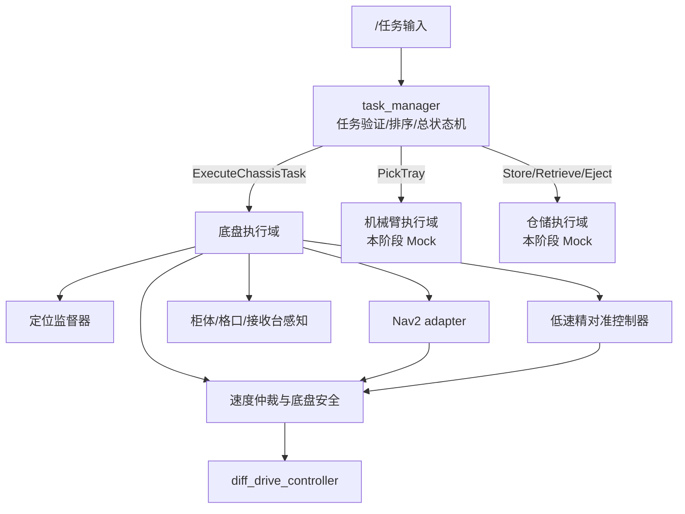
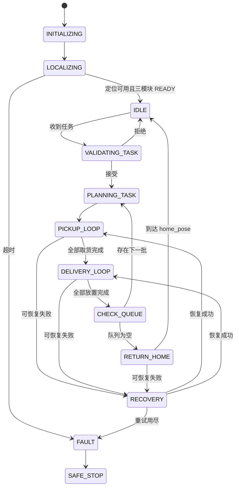
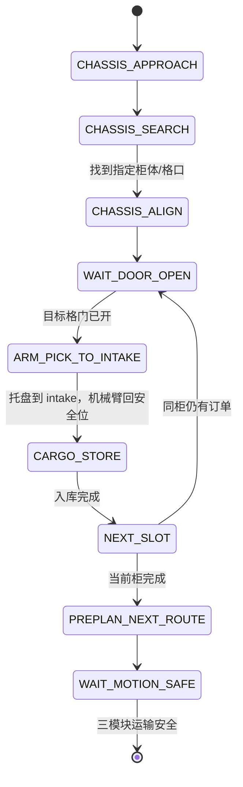

# 任务调度与底盘路径规划系统设计

**文档版本：** V0.1

**依据：** `robot项目总体框架与系统设计及开发计划_V0.1.md`

**实现基线：** Ubuntu 22.04、ROS 2 Humble、Gazebo Classic、Nav2、AMCL、两轮差速底盘

**本版范围：** 冻结总任务调度、三个下层执行域的公共接口，详细设计并实现底盘任务系统；机械臂和仓储暂用 Mock 节点代替。

---

## 1. 结论与核心决策

1. 系统只有一个业务编排者 `delivery_robot_task_manager`。它向底盘、机械臂、仓储三个执行域发送 Action，三个执行域不相互调用。
2. 定位、Nav2 路径规划、柜体/格口搜索、毫米级精对准都属于“底盘执行域”的内部能力，不直接暴露给其他下层模块。
3. `APPROACH` 由 Nav2 完成，只负责到达预设粗定位点；`SEARCH` 和 `ALIGN` 由专用低速视觉闭环完成。不用 Nav2 的 0.10 m 容差直接保证 50–100 mm 车柜间隙。
4. 机械臂的“托盘视觉锁定、叉齿开度、直线伸入、抬升 3 mm、水平退出、转移到车内入库口、回零”由机械臂 Action 内部状态机完成。总调度不发关节或末端位姿命令。
5. “仓储入库时同时规划下一段底盘路线”可以并行；第一阶段只允许并行计算路径，不允许机械臂/仓储未进入运输安全位时底盘开始运动。
6. 用户流程中“抬升后进入 `enter2` 水平退出”命名容易误解，接口统一命名为 `EXIT_HORIZONTAL`，不再使用 `ENTER2`。
7. `BACK` 表示“返回 home_pose”，不表示全程倒车。返程仍由 Nav2 正常规划，仅把最高线速度限制为 0.15 m/s。
8. Gazebo 基线已冻结为当前仓库使用的 Gazebo Classic，本阶段不迁移到 Fortress。
9. 柜前精对准时使用车体侧面朝向目标格口，不默认车头朝向柜体。左/右侧、侧面基准偏置和侧面开口的车身纵向偏置均从 YAML 读取。

---

## 2. 系统边界



### 2.1 解耦约束

- 总调度不发布 `/cmd_vel`，不直接调用 Nav2，不直接控制 MoveIt 或 `ros2_control`。
- 底盘、机械臂、仓储不订阅对方的业务命令，不以对方内部状态驱动自己的业务状态机。
- 模块只可发布自己的状态和感知结果。跨模块的启动、等待、取消和重试均由总调度决定。
- 每个模块同时最多执行一个会改变设备状态的 Action Goal，但允许同时发布状态 Topic。
- 所有 Action 必须实现 accept/reject、feedback、cancel、timeout 和明确错误码。

---

## 3. 任务数据模型和计划结果

### 3.1 输入任务

保留总体文档中的 `Order.msg`，新增批次消息：

```text
# DeliveryTask.msg
std_msgs/Header header
string task_id
uint32 revision
delivery_robot_interfaces/Order[] orders
bool on_time_mode
```

`Order.delivery_pose` 是 `map` 坐标系下的放置点粗定位位姿。`locker_id` 用来从 `site_waypoints.yaml` 查找柜体预设点，`locker_slot` 使用 1–9。

任务管理器订阅：

```text
/task_manager/task_requests    DeliveryTask    reliable, keep_last=10
```

为解决 Topic 无法直接返回接受/拒绝的问题，必须同时发布：

```text
# TaskAcceptance.msg
std_msgs/Header header
string task_id
uint32 revision
bool accepted
uint16 reason_code
string message
uint16 queue_position
```

```text
/task_manager/task_acceptance  TaskAcceptance  reliable, transient_local
/task_manager/task_state       TaskState       reliable, transient_local
```

`task_id + revision` 是幂等键。重复投递不得创建第二个任务。已开始执行的 revision 第一阶段不允许在线修改，新 revision 进入下一批。

生产任务入口以上述 Topic 为准。总体文档中的 `ExecuteDeliveryTask.action` 可保留为调试/上位机适配入口，但 Action Server 必须把 Goal 转换成同一个内部任务队列记录，不允许维护第二套任务状态机。

### 3.2 接收校验

任务进入队列前必须校验：

- `task_id` 和 `order_id` 非空，批内 `order_id` 唯一，订单数为 1–5。
- `locker_slot` 为 1–9，`locker_id` 在点位库中存在。
- `delivery_pose.header.frame_id == "map"`，数值有限，四元数合法。
- 放置点在地图内、不在占据格和膨胀禁行区内，并有可规划路径。
- 截止时间、优先级和任务状态合法。
- 当前批次已满载时，新任务只能进入下一批队列。

### 3.3 任务计划器输出

总调度内部生成不对外暴露的 `MissionPlan`：

```text
MissionPlan
├── task_id
├── pickup_stops[]
│   ├── locker_id
│   ├── locker_staging_pose
│   └── order_ids[]       # 同一柜体的订单合并
├── delivery_stops[]
│   ├── order_id
│   ├── delivery_pose
│   └── cargo_slot
└── home_pose
```

计划次序：

1. 同一 `locker_id` 合并为一个柜前停靠，避免同一柜体反复 `APPROACH/ALIGN`。
2. 多柜体时先用路径长度排取货顺序；第一版使用最近邻 + 2-opt。
3. 放置顺序综合路径长度、deadline、priority 和仓储可达性。
4. 首个放置的订单必须分配到 S1 或 S2；调度器选择目标货位，仓储模块只校验并执行。
5. 任务管理器维护“期望库存”，但只有 Cargo Action 成功且 `CargoState` 一致时才提交状态，禁止仅修改订单变量就认为托盘已移动。

---

## 4. 总任务调度状态机

### 4.1 主状态机



### 4.2 单个取货停靠的子状态机



说明：

- 底盘 Action 内部依次反馈 `APPROACH -> SEARCH -> ALIGN -> HOLD`。总调度不操纵其内部控制循环。
- 同一柜体下一格口如果仍在机械臂可达域内，底盘保持刹车，不重复导航。若必须换位，则由新的 Chassis Goal 执行。
- 机械臂进货交接完成后，总调度才启动 `StoreTray`。仓储未确认成功时不得把该订单标记为已入库。
- `PREPLAN_NEXT_ROUTE` 可与仓储内部动作并行，但底盘只在 `arm.transport_safe && cargo.transport_safe` 后取得速度权限。

### 4.3 机械臂 Action 内部阶段（预留）

```text
WAIT_DOOR_OPEN          # 总调度在发 Goal 前完成此门控互锁
MOVE_TO_SLOT_FRONT
TRACK_TRAY              # 末端相机识别托盘中心/叉孔
VISUAL_SERVO_ALIGN      # 持续调整末端位姿
LOCK_3_FRAMES           # 连续 3 帧稳定
SET_FORK_OPENING
ENTER_LINEAR            # 笛卡尔水平直线伸入
LIFT_3MM                # z 方向抬升 0.003 m
EXIT_HORIZONTAL         # 水平直线退出柜体
LOAD_APPROACH
LOAD_ALIGN
LOAD_ENTER
RELEASE_TRAY
LOAD_EXIT
RETURN_HOME_POSE
```

稳定锁定不能只计“检测到 3 帧”，还必须校验三帧位姿方差、时间戳和置信度。初值建议为：中心位置极差 ≤ 2 mm、姿态极差 ≤ 1°、置信度 ≥ 0.8，全部参数化。

### 4.4 放置子状态机

```text
CHASSIS_APPROACH_DELIVERY
  -> CHASSIS_ALIGN_RECEIVER (当 requires_precision_align=true)
  -> HOLD_BRAKE
  -> CARGO_RETRIEVE_TO_T
  -> CARGO_EJECT
  -> VERIFY_EJECTED
  -> UPDATE_ORDER_DELIVERED
  -> NEXT_DELIVERY / RETURN_HOME
```

`Order.delivery_pose` 即使由任务直接给出，也只能保证 Nav2 粗定位。如果实际接收台仍要求 0–5 mm 间隙，必须启用 `ALIGN_RECEIVER`；只有仿真中不模拟接触间隙时才可关闭。

---

## 5. 公共 Action 和状态接口

### 5.1 底盘高层 Action

```text
# ExecuteChassisTask.action
# Goal
uint8 APPROACH_PICKUP=1
uint8 APPROACH_DELIVERY=2
uint8 RETURN_HOME=3
uint8 PREPARE_ROUTE=4
uint8 STATION_LOCKER=1
uint8 STATION_RECEIVER=2
uint8 STATION_HOME=3

string task_id
string order_id
uint8 operation
string station_id
uint8 station_type
geometry_msgs/PoseStamped staging_pose
geometry_msgs/PoseStamped target_hint_pose
uint8 locker_slot
bool requires_precision_align
float32 target_gap_m
float32 max_linear_speed_mps
builtin_interfaces/Duration timeout
string prepared_route_id
---
# Result
bool success
uint16 error_code
string message
geometry_msgs/PoseStamped final_base_pose
geometry_msgs/PoseStamped detected_target_pose
float32 measured_gap_m
bool holding_brake
string prepared_route_id
---
# Feedback
uint8 IDLE=0
uint8 PLANNING=1
uint8 APPROACH=2
uint8 SEARCH=3
uint8 ALIGN=4
uint8 HOLD=5
uint8 BACK=6

uint8 phase
float32 progress
float32 remaining_distance_m
float32 lateral_error_m
float32 yaw_error_rad
string detail
```

`PREPARE_ROUTE` 只调用 `ComputePathToPose`并缓存结果，绝不获取底盘速度权限。实际执行 `APPROACH_*` 前必须重新校验定位、路径有效性和安全互锁。

### 5.2 机械臂接口（本阶段 Mock）

沿用总体文档的 `PickTray.action`，补充必要的几何和安全字段：

```text
# PickTray.action
# Goal
string task_id
string order_id
string locker_id
uint8 locker_slot
geometry_msgs/PoseStamped slot_hint_pose
string intake_frame
float32 enter_distance_m
float32 lift_distance_m       # 默认 0.003
---
# Result
bool success
uint16 error_code
string message
bool tray_at_intake
bool arm_at_home
bool transport_safe
---
# Feedback
uint8 phase
float32 progress
geometry_msgs/PoseStamped tool_pose
float32 target_stability
uint8 stable_frame_count
float32 fork_opening_m
```

### 5.3 仓储接口（本阶段 Mock）

保留三个粒度清晰的 Action：

- `StoreTray.action`：`intake_frame -> S1...S5`。Goal 必须包含 `task_id/order_id/target_slot`。
- `RetrieveTray.action`：`S1...S5 -> T`。Goal 必须包含 `task_id/order_id/source_slot`。
- `EjectTray.action`：`T -> receiver`。Goal 必须包含 `task_id/order_id/receiver_id/target_gap_m`。

三个 Result 都必须包含：

```text
bool success
uint16 error_code
string message
bool transport_safe
```

### 5.4 通用模块状态

```text
# ModuleState.msg
std_msgs/Header header
uint8 MODULE_CHASSIS=1
uint8 MODULE_ARM=2
uint8 MODULE_CARGO=3
uint8 module
uint8 lifecycle_state
uint8 operation_state
bool ready
bool busy
bool transport_safe
bool emergency_stopped
uint16 fault_code
string detail
```

```text
/chassis/state   ModuleState   reliable, transient_local
/arm/state       ModuleState   reliable, transient_local
/cargo/state     ModuleState   reliable, transient_local
```

`transport_safe` 只表示该模块已进入底盘可移动的机械状态，不代表任务 Action 已成功。

### 5.5 柜体状态

```text
# LockerTargetState.msg
std_msgs/Header header
string locker_id
uint8 locker_slot
bool cabinet_detected
bool slot_detected
bool door_open
bool pose_valid
geometry_msgs/PoseStamped slot_pose
float32 confidence
```

```text
/chassis/locker_target_state  LockerTargetState  best_effort, keep_last=5
```

该 Topic 由底盘域内的柜体感知节点发布。总调度用它实现格门开启互锁，机械臂不直接依赖该节点。

### 5.6 错误码分段

| 范围 | 所有者 | 示例 |
|---|---|---|
| 1000–1999 | 总调度 | 任务非法、状态不一致、整体超时 |
| 2000–2999 | 底盘 | 未定位、无路径、柜体丢失、对准超时 |
| 3000–3999 | 机械臂 | 托盘未锁定、规划失败、叉取失败 |
| 4000–4999 | 仓储 | 货位冲突、T 区占用、推出未确认 |
| 9000–9999 | 公共安全 | 急停、关键 TF 丢失、通信丢失 |

---

## 6. 底盘执行域详细设计

### 6.1 内部节点

```text
car_chassis_task/
├── chassis_task_server       # ExecuteChassisTask Action Server
├── localization_supervisor   # 启动定位、质量判定和失效监督
├── nav2_adapter              # ComputePath/NavigateToPose/取消/错误映射
├── station_search            # 柜体、格口和接收台目标搜索
├── precision_align_controller# 差速底盘低速闭环
├── velocity_arbiter          # Nav2/Align/E-stop 速度唯一出口
└── chassis_safety_supervisor # 超时、障碍、制动和安全门控
```

`car_navigation` 保留为 Nav2 参数、地图和 launch 包，不把业务状态机塞入 Nav2 BT。Nav2 BT 只处理单段路径跟踪和导航恢复。

### 6.2 上电自主定位

现已由 `localization_supervisor` 自动发布 `/initialpose` 并监督 AMCL 收敛，不再依赖 RViz `2D Pose Estimate`。业务柜体点位仍保持 `calibrated: false`，防止柜体建模前误执行真实任务。

实现分三层：

1. **仿真已知出生位姿**：Gazebo 世界位姿 `x/y/yaw` 与 AMCL 地图位姿 `initial_x/initial_y/initial_yaw` 分开配置；当前 Gazebo 原点对应的地图初值暂估为 `[-14.65, -4.375, 1.2272]`，柜体模型和地图定版后必须重新标定。
2. **实车在已知 home 上电**：使用已标定 `home_pose` 作为 AMCL 初值，用雷达匹配完成收敛。
3. **起点未知（预留）**：可调用 AMCL 全局重定位并配合原地低速旋转收集观测；当前基线默认关闭自动全局重定位，避免已知初值在静止阶段被误清除。

需要明确：AMCL 本身不能在所有对称地图上保证无先验全局定位。如实车上电点不受约束，需增加唯一 AprilTag/场站标记或人工初始化作为最终兜底。

定位就绪条件全部满足后才发布 `localized=true`：

- `map -> odom -> base_footprint` TF 连续可用且时延小于参数阈值。
- `/scan` 和 `/odom` 时间戳连续，频率不低于设定值。
- AMCL 位姿协方差低于阈值，且连续 N 次检查稳定。当前 Gazebo 初值：`xy variance < 0.04 m²`、`yaw variance < (10°)²`、`N=3`；AMCL 配置为每帧激光更新，以便静止启动也能持续监督定位质量。
- 车体位姿在地图可通行区内。

### 6.3 `APPROACH` 路径规划

执行顺序：

1. 检查定位质量、目标 frame、位姿和模块运输安全位。
2. 调用 `ComputePathToPose`。无路径时拒绝执行，不先让底盘运动。
3. 路径通过占据、长度、起终点偏差和时间戳校验后，发送 `NavigateToPose`。
4. 正常速度上限 0.30 m/s；柜前最后接近段 0.05–0.10 m/s；返回 home 不超过 0.15 m/s。
5. 取消、超时、进度失败或定位丢失时，先撤销 Nav2 Goal、确认速度为零，再返回 Action Result。

第一阶段可继续使用当前 `NavfnPlanner(use_astar=true) + DWB`。车体方向性、窄通道或大尺寸转弯导致路径质量不足时，再替换为 Smac Hybrid-A*，不影响上层 Action。

建议把静态地图的 `allow_unknown` 从当前 `true` 改为 `false`，避免将未知格当成可通行区。该参数要在现有地图边界测试通过后再提交。

### 6.4 `SEARCH`

`SEARCH` 分两类目标，不与机械臂末端托盘搜索混用：

- `SEARCH_STATION`：在预设点附近确认 `locker_id` 或 `receiver_id`。
- `SEARCH_SLOT`：根据 1–9 格口编号确认目标格口位姿。

逻辑：

1. 到达 staging pose 后刹车停稳。
2. 首先在当前视野检测；若已看到正确柜体，直接搜索目标格口。
3. 未检测到时执行有界的小角度左右扫描，不在柜前执行 Nav2 的大角度恢复 spin。
4. 检测结果必须与任务中 `locker_id + locker_slot` 一致，连续多帧合法后才计算 `ALIGN` 目标。
5. 超时或标识不一致时返回错误，不对未知格口执行机械臂动作。

### 6.5 `ALIGN`

柜体最终间隙默认设为 0.075 m，合格区间为 0.05–0.10 m。目标位姿按柜体基准坐标计算：

```text
T_map_base_goal = T_map_locker * T_locker_base_desired
```

`T_locker_base_desired` 必须使车体指定侧面朝向柜体。柜体目标位姿的 `+x` 轴规定为从柜面指向走廊的外法线：使用左侧面时车体 yaw 为柜体 yaw `+pi/2`，使用右侧面时为 `-pi/2`。车体中心到柜面的法向距离为“侧面基准偏置 + 目标间隙”；若作业开口不在车身纵向中心，再使用 `side_reference_x_m` 沿 `base_link +x` 修正。

默认几何参数放入 `side_alignment.yaml`：

```yaml
side_alignment:
  ros__parameters:
    docking_side: right       # left | right
    base_side_offset_m: 0.35  # base_footprint 到车体作业侧基准面
    side_reference_x_m: 0.0   # 侧面作业开口相对车体中心的 x 偏置
    target_gap_m: 0.075
    min_gap_m: 0.05
    max_gap_m: 0.10
```

车体已确认的几何解释为：`base_link` 中心为原点，`x` 向车头、`y` 向车左、`z` 向车顶；1100×700 mm 底盘的外廓为 `x=+/-0.55 m`、`y=+/-0.35 m`。因此侧面对柜时 `base_link` 中心到柜面的法向目标距离为 0.40–0.45 m。

用户给定的 `(550, +/-15, 650 +/-150) mm` 暂作为车头作业开口相对 `base_link` 的机械臂交接包络：中心 `[0.55, 0.0, 0.65] m`，`y` 容差 `+/-0.015 m`，`z` 容差 `+/-0.15 m`。该包络只用于后续机械臂 `LOAD_APPROACH/ALIGN/ENTER`，不参与底盘侧面间隙计算。

差速底盘没有横向自由度，因此精对准控制器必须用小弧线或“转向—前进—回正”消除横向误差，不得输出 `linear.y`。

柜前建议初始合格条件：

- 前向间隙 0.05–0.10 m，目标值 0.075 m。
- 相对横向误差 ≤ 0.02 m。
- 相对航向误差 ≤ 2°。
- 连续 10 个控制周期满足阈值，且车轮速度为零。

精对准期间必须保持前向碰撞监测。由于 50–100 mm 可能小于相机/雷达的有效近距离，不能默认现有单线雷达能测到最终间隙。真实结构需要保证标记仍可见，或增加前端 ToF/超声/接触开关作为最终距离依据。

### 6.6 速度唯一所有权

当前仿真模型把 `diff_drive_controller/cmd_vel_unstamped` 直接重映射为 `/cmd_vel`。增加精对准控制器后必须改为单一仲裁出口：

```text
/cmd_vel_nav     --\
/cmd_vel_align   ----> velocity_arbiter ---> /cmd_vel_safe ---> diff_drive_controller
/cmd_vel_teleop  --/                            ^
/emergency_stop --------------------------------|
```

优先级：`emergency_stop > align > nav > teleop`。非活动源必须超时归零；Action 切换时先输出零速并确认停稳，再移交速度所有权。调试遥控不能在自主任务期间默认获得控制权。

---

## 7. 超时、重试和安全门控

### 7.1 建议初值

| 动作 | 超时 | 自动重试 | 失败后行为 |
|---|---:|---:|---|
| 启动定位 | 60 s | 1 | 停车，等待人工初始位姿 |
| `APPROACH` | 120 s | 1 | 清理代价地图后重规划 |
| `SEARCH_STATION/SLOT` | 20 s | 1 | 回到预设观测姿态再扫描 |
| `ALIGN` | 30 s | 1 | 退回安全观测位，不盲目继续向前 |
| 等待格门 | 30 s | 0 | 保持停车，上报柜门超时 |
| `PickTray` | 90 s | 1 | 机械臂安全撤回 |
| `StoreTray` | 45 s | 0 | 保持机构、禁止底盘移动 |
| `RetrieveTray` | 45 s | 0 | 保持机构、禁止推出 |
| `EjectTray` | 30 s | 0 | 停止推杆，等待人工确认 |

所有值放在 `mission_timeouts.yaml`，不写死在节点中。

### 7.2 底盘可移动条件

```text
localized
&& chassis.ready
&& arm.ready
&& cargo.ready
&& arm.transport_safe
&& cargo.transport_safe
&& !emergency_stop
&& no_fatal_fault
&& cmd_vel_owner == CHASSIS
```

任一条件在移动中失效，底盘安全节点立即使速度平滑降为零，取消 Nav2/对准 Goal，总调度再进入恢复或故障状态。

### 7.3 任务取消

取消顺序：

1. 阻止发送新 Goal。
2. 取消底盘 Action 并确认底盘停稳。
3. 取消机械臂/仓储 Action，由各模块进入自己的安全保持或撤回状态。
4. 等待三个模块报告 safe 或超时。
5. 写入任务结果和当前托盘物理位置，禁止自动假定托盘已回到原位。

---

## 8. 软件包落地方案

```text
src/
├── delivery_robot_interfaces/    # msg/srv/action，最先冻结
├── delivery_robot_task_manager/  # 任务队列、调度、分层状态机
├── car_chassis_task/             # 底盘 Action、定位监督、搜索/侧面对准、速度仲裁
├── car_navigation/               # 已有 Nav2/地图/参数
├── delivery_robot_module_mocks/  # Arm/Cargo Action Mock
├── delivery_robot_bringup/       # 总 launch、节点生命周期
└── urdf/                         # 现有 car_description，后续再整理路径
```

建议实现语言：

- 总任务调度、任务计划和 Mock：Python `rclpy`，便于状态机与测试。
- 底盘 Action 编排可用 `rclpy`；精对准闭环、速度仲裁和安全监督建议 C++ `rclcpp`。
- 总调度使用显式分层状态机，不用多层 if/else 或回调串联。每次状态转移都记录 `task_id/order_id/from/to/reason/timestamp`。

---

## 9. 现有仓库与目标的差距

| 项目 | 当前现状 | 需要补齐 |
|---|---|---|
| ROS 包 | 已增加 interfaces、task manager、chassis task、mocks、bringup | 柜体模型导入后补感知适配器与端到端场景测试 |
| 仿真器 | 当前实际使用 `gazebo_ros`/Gazebo Classic | 已冻结继续使用 Gazebo Classic，后续同步更新总体文档基线 |
| 初始定位 | 已实现 `localization_supervisor` 和自动 `/initialpose` | 地图定版后精确标定 Gazebo 世界原点到地图初值 |
| 业务点位 | `site_waypoints.yaml` 全为 0，`calibrated=false` | 实测 home、locker staging、测试 delivery pose |
| 传感器 | 只有单个 `laser_link` 和 `/scan` | 补前/后雷达、IMU、相机及 TF，或先明确单雷达仿真边界 |
| 里程计 | `diff_drive_controller` 直接发 `/odom` 和 TF | 实车阶段加 `robot_localization`，确保 `odom->base_footprint` 只有一个发布者 |
| 普通导航 | Navfn A* + DWB 已包装为 `ExecuteChassisTask` | 柜体点位标定后完成端到端路线验收 |
| 精对准 | 已实现 SEARCH、侧面 ALIGN 和 Gazebo 真值目标适配入口 | 柜体模型导入后接真实检测输出与最终间隙传感器 |
| 速度所有权 | 已由 velocity arbiter 独占 `/cmd_vel_safe` | 实车阶段接入硬件急停链路 |
| 机械臂/仓储 | 已提供与最终接口一致的 Mock Action Server | 后续用真实模块替换 Mock，调度层接口不变 |

仿真器基线已确认为 Gazebo Classic。总体文档中的 Fortress 表述后续应在版本升级时同步修正，但不阻塞本计划实施。

---

## 10. 分阶段实施计划

### P0：接口和基线冻结（2–3 天）

- 记录已冻结的 Gazebo Classic 基线，保持现有启动链。
- 创建 `delivery_robot_interfaces`，编译本文定义的 msg/action。
- 冻结 frame、状态枚举、错误码、QoS、超时配置。
- 创建 Arm/Cargo Mock，可设置延时、成功、超时和指定错误。

**退出条件：** 接口包可编译，Mock 可以接受/反馈/取消 Goal，公共接口有自动化测试。

### P1：自动定位与点位标定（3–5 天）

- 分别配置 Gazebo spawn pose 与地图 `/initialpose`，并完成两坐标系标定。
- 实现定位质量监督、全局重定位和超时。
- 标定 `home_pose`、至少一个 `locker_staging_pose` 和两个 delivery pose。
- 自动检查 TF 唯一所有权。

**退出条件：** 无 RViz 手动操作启动，10 次仿真中自动进入 `localized` 且位姿误差达到总体文档 A02。

### P2：底盘 `APPROACH/BACK` Action（3–5 天）

- 实现 Nav2 adapter 和 `ExecuteChassisTask`。
- 实现目标校验、路径预计算、取消、超时、一次恢复和错误映射。
- 实现速度仲裁和运输安全门控。

**退出条件：** 完成 home -> locker -> delivery -> home 三段导航，取消后及时停车，无速度发布冲突。

### P3：`SEARCH/ALIGN` （5–7 天）

- 先用 Gazebo 真值或 AprilTag 实现统一目标位姿输出。
- 实现柜体 ID、3×3 格口映射、有界搜索和门状态。
- 实现差速底盘低速对准和前向安全监测。
- 完成 50–100 mm 车头间隙的稳定判定。

**退出条件：** 9 个格口均可搜索并生成对准结果，对准失败时不碰柜、错误码正确。

### P4：总任务调度（5–7 天）

- 实现任务订阅、幂等接收、队列、验证和计划。
- 实现取货、入库、放置、返回 home 的分层状态机。
- 使用 Mock 验证三模块编排、并行预规划和运输安全门控。
- 实现每个状态的超时、取消、重试和持久化日志。

**退出条件：** 1 件和 5 件 Mock 任务可自动闭环，失败注入不会发生跨订单串状态。

### P5：集成和验收（3–5 天）

- 执行正常、任务取消、定位丢失、无路径、柜体未检测、格门超时、Arm/Cargo Mock 失败等场景。
- 自动保存 rosbag、Action 结果、状态转移日志和误差统计。
- 形成机械臂和仓储真实模块的接入检查表。

**退出条件：** 总体文档 A01–A06、A11、A17、A18 中与本阶段相关部分通过；机械臂/仓储的物理动作项等真实模块接入后再验收。

---

## 11. 最小集成测试集

1. **上电定位**：三个不同 spawn pose，无 RViz 操作进入 IDLE。
2. **单单正常流程**：`APPROACH -> SEARCH -> ALIGN -> door -> Arm Mock -> Cargo Store Mock -> delivery -> Eject Mock -> BACK`。
3. **同柜五格**：只执行一次柜前导航/对准，五个订单不串单。
4. **多柜取货**：入库期间可预规划下一段，但 `transport_safe=false` 时轮速始终为零。
5. **柜体未找到**：一次有界重试后返回 2xxx 错误，机械臂不收到 Goal。
6. **格门未开**：保持刹车，30 s 后失败，不执行伸入。
7. **导航取消**：Action 取消后底盘及时停止，速度所有权释放。
8. **定位丢失**：移动中断开 `map->odom`，系统停车并进入 recovery，不继续盲走。
9. **Cargo 失败**：不更新库存或订单状态，底盘不移动。
10. **放置点不可达**：任务接受或执行前规划失败，给出明确拒绝/失败原因。

---

## 12. 接入机械臂和仓储前必须冻结的参数

机械臂：

- 格口基准坐标和 1–9 映射。
- `slot_front_pose`、`enter_distance_m`、`intake_frame` 和车体碰撞包络。
- 托盘中心、叉孔间距、叉齿可调范围和夹持/到位信号。
- 相机到 `fork_tool0` 外参、锁定稳定阈值和丢检处理。

仓储：

- S1–S5、T、`intake_frame`、`output_frame` 的统一 TF 和参数源。
- 每个货位占用/托盘到位传感器语义。
- `transport_safe` 的具体机械条件。
- 入库、移到 T、推出的超时、互锁和中途取消安全状态。

以上参数冻结后，真实 Arm/Cargo Action Server 只要替换 Mock，总任务调度和底盘系统不需改变业务接口。

---

## 13. 需要在开始编码前确认的 P0 决策

1. **已确认：** 继续使用 Gazebo Classic。
2. **已确认：** 底盘使用侧面对柜；外廓按 `x=+/-0.55 m`、`y=+/-0.35 m`，侧面至柜面保持 0.05–0.10 m。作业侧仍保留 `left/right` YAML 参数，默认 `right`。
3. **已确认：** 柜体后续建模导入 Gazebo；建模完成前使用 Gazebo 真值适配接口，柜门开启使用手动 Service 输入。
4. **已确认：** `delivery_pose` 暂时仅为 staging pose，接收台暂不执行 0–5 mm 精对准。
5. **已确认：** 第一阶段仓储动作期间底盘严格禁止移动，只允许并行路径计算。
